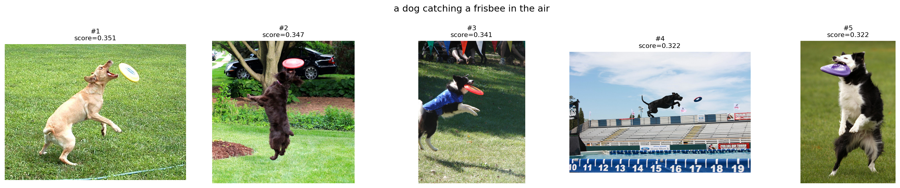
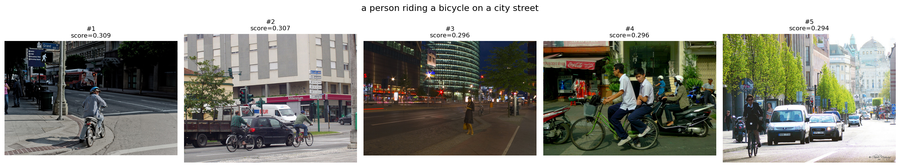
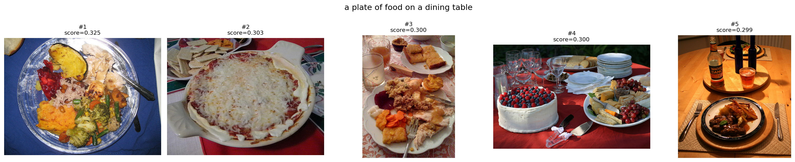

# ECS189G SP2026 — HW3 Report
Name: Gezheng Kang 
---

## Task 3: Zero-Shot Image Classification

**Dataset:** Imagenette validation set (3,925 images, 10 classes)

| Setting | Accuracy |
|---|---|
| Bare class names | **98.45%** |

**Analysis:** CLIP hits 98.45% zero-shot accuracy on Imagenette with just the raw class names as prompts. That performance makes sense given the dataset's structure. Imagenette classes like "chain saw" and "parachute" are visually distinctive and don't have ambiguous meanings. Because CLIP was pre-trained on a huge set of image-text pairs, it has well-developed priors for these kinds of concrete, clearly defined concepts.

---

## Task 4: Prompt Engineering

**Prompts tested:**

- **Bare:** `["tench", "English springer", "cassette player", ...]`
- **Templated:** `["a photo of a tench", "a photo of a English springer", ...]`

| Prompt Style | Accuracy |
|---|---|
| Bare class names | 98.45% |
| `"a photo of a ..."` template | 98.45% |
| Ensemble (19 diverse templates, averaged) | **98.60%** |

**Analysis:** The single template prompt yields no improvement over bare class names. Imagenette's 10 classes are visually distinct enough that CLIP handles bare nouns just as well. However, the ensemble approach (encoding 19 diverse templates per class, averaging their embeddings, then re-normalizing) achieves a small but consistent 0.15% gain. This matches the finding from Radford et al. (2021): prompt ensembling reduces variance across prompt phrasings and produces a more robust text embedding, especially when some templates happen to misalign with the model's training distribution. On harder benchmarks with finer-grained classes the gain is typically 3–5%, but on Imagenette the headroom is limited since accuracy is already near ceiling.

---

## Task 5: Text-to-Image Retrieval

**Dataset:** COCO Validation 2017 (~5,000 images)  
**Method:** Cosine similarity between CLIP text and image embeddings (L2-normalized), top-5 retrieval.

### Query 1: *"a dog catching a frisbee in the air"*

{width=100%}

| Rank | Image | Score |
|---|---|---|
| 1 | 000000255664.jpg | 0.3511 |
| 2 | 000000017029.jpg | 0.3466 |
| 3 | 000000369541.jpg | 0.3408 |
| 4 | 000000225670.jpg | 0.3218 |
| 5 | 000000138492.jpg | 0.3215 |

**Analysis:** All 5 results are accurate. Every image shows a dog actively catching or leaping for a frisbee. The model correctly captures both subjects ("dog") and the specific action ("catching a frisbee in the air"). This query is a strong success case, likely because frisbee-catching dogs are a common and visually consistent concept in CLIP's training data.

---

### Query 2: *"a person riding a bicycle on a city street"*

| Rank | Image | Score |
|---|---|---|
| 1 | 000000380706.jpg | 0.3095 |
| 2 | 000000169996.jpg | 0.3069 |
| 3 | 000000119516.jpg | 0.2965 |
| 4 | 000000038829.jpg | 0.2956 |
| 5 | 000000122166.jpg | 0.2942 |

**Analysis:** All 5 results show cyclists in urban environments. Results 1, 2, and 5 are strong matches. They clearly show a person on a bicycle in a city. Result 3 is a nighttime street scene with a cyclist, which is conceptually correct but noisier. Result 4 includes motorcycles alongside bicycles, suggesting the model conflated "bicycle" with broader two-wheeled vehicles in a busy traffic scene. Overall scores are lower (roughly 0.29 to 0.31) than the frisbee query, reflecting that this scene is more compositionally complex and common in many contexts.

---

### Query 3: *"a plate of food on a dining table"*

| Rank | Image | Score |
|---|---|---|
| 1 | 000000561889.jpg | 0.3247 |
| 2 | 000000236412.jpg | 0.3030 |
| 3 | 000000419312.jpg | 0.3004 |
| 4 | 000000002157.jpg | 0.2999 |
| 5 | 000000166426.jpg | 0.2986 |

**Analysis:** Results 1 (mixed vegetables), 2 (pizza), and 5 (plated meal on a table) are clear matches. Result 3 shows multiple food items spread across a surface. It is correct in spirit but less structured as a "plate on a table." Result 4 appears to be a bowl of berries or fruit, which is conceptually similar (food in a dish) but does not strongly satisfy "plate of food on a dining table." This query highlights a known limitation of CLIP retrieval: the model struggles with spatial and relational qualifiers like "on a dining table" and may retrieve any salient food image regardless of setting.
