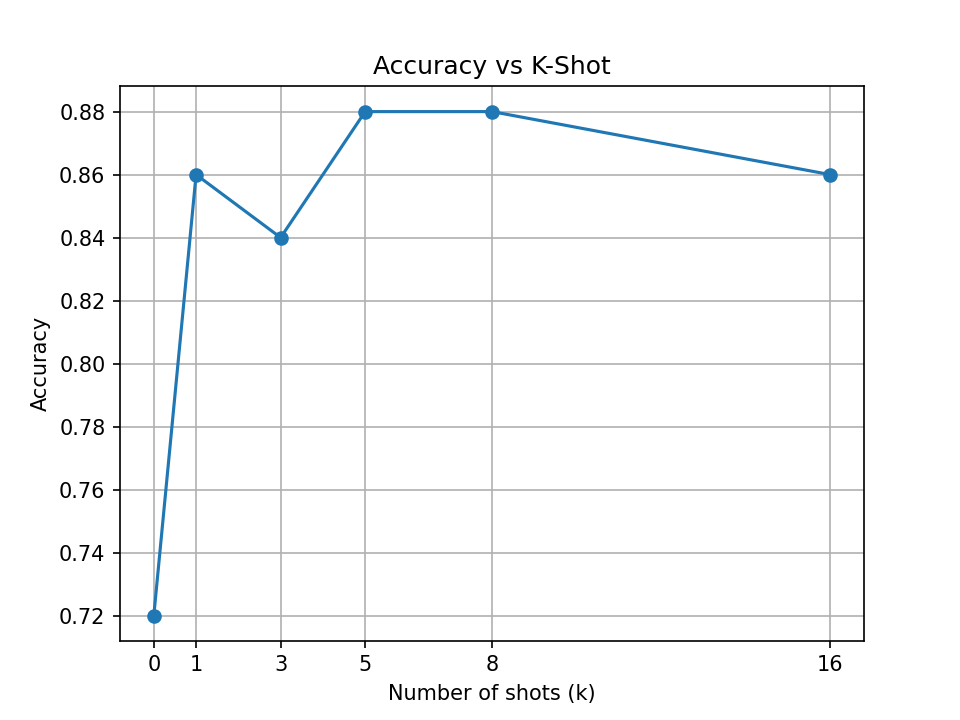

# ECS 189G Spring 2026 — HW2 Report
##  Gezheng Kang, gzkang@ucdavis.edu


## Task 3: Manual Observations with In-Context Learning

I tested three different reviews: two were negative, one was positive.

| Review | Predicted Sentiment | Correct? |
|--------|-------------------|----------|
| "Cannot find any redeeming qualities in this film." | Negative | YES |
| "Could not be better." | Positive | YES |
| "The movie was a complete disaster from start to finish." | Negative | YES |

**Observations:**

- The model correctly classified reviews with strong, unambiguous sentiment. Phrases like “cannot find any redeeming qualities” and “complete disaster” were reliably predicted as negative, while “could not be better” was predicted as positive.

- Overall, this suggests that in-context learning (ICL) with a base model performs well on prototypical sentiment cases.

---

## Task 5: K-Shot Scaling Experiment

The evaluation pipeline in `eval_task5.py` was run on 50 randomly sampled examples from `val.json` across six values of k. Exemplars were randomly sampled from `train.json` with a fixed seed (42) for reproducibility.

### Results

| k | Accuracy | Correct / Total |
|---|----------|----------------|
| 0 | 72.00% | 36 / 50 |
| 1 | 86.00% | 43 / 50 |
| 3 | 84.00% | 42 / 50 |
| 5 | 88.00% | 44 / 50 |
| 8 | 88.00% | 44 / 50 |
| 16 | 86.00% | 43 / 50 |




* Fig: The accuracy vs. k plot *

### Analysis

- **k=0 (zero-shot):** The model achieves 72% accuracy without any examples. This is above random chance (50%), indicating that Qwen3-0.6B-Base has latent knowledge of sentiment from pretraining. However, without format guidance, the model frequently generates open-ended text rather than a clean label.
- **k=1:** Accuracy jumps to 86% with just a single exemplar. One example is sufficient for the model to understand the expected output format (`Review / Sentiment: Positive`) contributing to a high accurary. 
- **k=3 to k=16:** Accuracy fluctuates in a narrow band between 84–88% with no clear monotonic improvement. This suggests diminishing returns after k=1 for this model and task size. The slight variation across k values is likely due to the randomness in exemplar selection rather than a true effect of additional context.
- **Overall:** The largest benefit from ICL comes from adding the very first example, which teaches the model the output format. Beyond that, additional shots provide marginal and inconsistent gains, suggesting that format learning rather than task learning drives performance here.

---

## Task 6: Prompt Sensitivity & Robustness

The evaluation was fixed at **k=5** and run on 50 samples from `val.json`. Three prompt variants were compared.

### Prompt Templates

**Variant 1 — Standard (baseline):**
```
Review: [sentence]
Sentiment: Positive/Negative
```

**Variant 2 — Format Shift:**
```
Input: [sentence] | Label: Positive/Negative
```
The separator character and keyword names (`Input`, `Label`) are changed while the label words remain the same.

**Variant 3 — Label Word Shift:**
```
Review: [sentence]
Sentiment: Good/Bad
```
Same layout as standard, but label words are swapped from `Positive/Negative` to `Good/Bad`.

### Results

| Variant | Accuracy | Correct / Total |
|---------|----------|----------------|
| Standard (Review/Sentiment, Pos/Neg) | 88.00% | 44 / 50 |
| Format Shift (Input \| Label, Pos/Neg) | 92.00% | 46 / 50 |
| Label Word Shift (Review/Sentiment, Good/Bad) | 80.00% | 40 / 50 |

### Analysis

- **Format Shift outperforms the baseline (92% vs 88%).** This is unexpected but explainable: the pipe-separated `Input: [...] | Label:` layout is a common pattern in structured data that Qwen3 likely encountered during pretraining. The model may associate this format strongly with classification tasks, making it easier to follow.
- **Label Word Shift causes a noticeable drop (80%).** Replacing `Positive/Negative` with `Good/Bad` reduces accuracy even compared with the baseline. This demonstrates that base models are sensitive to the specific label vocabulary used. The model has strong associations between the word "Sentiment" and the labels "Positive/Negative" from pretraining on movie review datasets and similar corpora. Changing the label words breaks this association, leading to incorrect predictions.
- **Conclusion:** Base models are more sensitive to label word choice than to surface-level formatting. The format can be changed with little or no loss as long as the label words match learned associations. However, changing label words — even to semantically equivalent ones — can reduce performance a lot.
